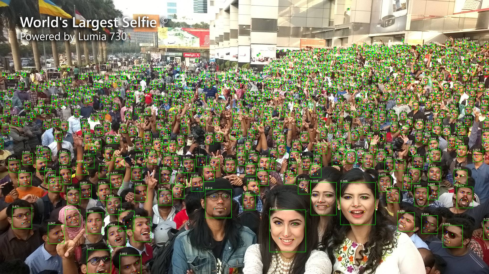

## yolov5-face

在yolov5的基础上增加landmark预测分支，loss使用wingloss,使用yolov5s取得了相对于retinaface-r50更好的性能。

#### WiderFace测试

* 在wider face val精度（单尺度最大边输入分辨率：**1024**）

| Backbone                             | Easy  | Medium | Hard  |
| ------------------------------------ | ----- | ------ | ----- |
| yolov5s                              | 95.4% | 94.6%  | 88.2% |
| Yolov5m                              | 95.8% | 95.1%  | 90.5% |
| RetinaFace-R50(original image scale) | 95.5% | 94.0%  | 84.4% |

#### 模型测试下载地址

* yolov5s:链接: https://pan.baidu.com/s/1t51CFeofy1slOw_lgb3UDg  密码: mkh0
* Yolov5m:

#### 模型测试效果

#### References

https://github.com/ultralytics/yolov5

https://github.com/DayBreak-u/yolo-face-with-landmark

https://github.com/xialuxi/yolov5_face_landmark

https://github.com/biubug6/Pytorch_Retinaface
