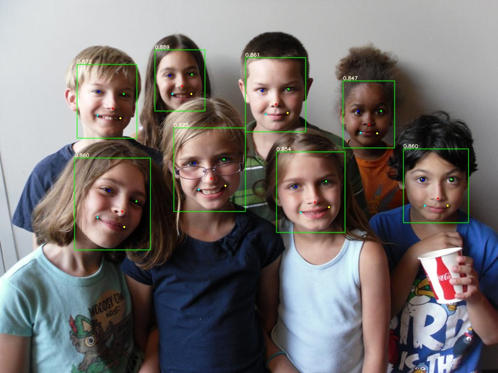

# 整体流程
## 1.Pytorch->ONNX

`/models/export.py`配置weights路径，导出**yolov5n-0.5.onnx**
## 2.TensorRT推理
`/torch2tensorrt/main.py`

图像预处理 -> TensorRT推理 -> 可视化结果
>注:若ONNX转化失败, 可降低`/models/export.py`中opset_version版本

# 耗时对比

|Model |Time |
|:---:|:----:|
|Pytorch|11ms|
|TensorRT|5ms|

>注：网络yolov5n-0.5  分辨率640x640

# 可视化

 
 

# 待更

- [ ] TensorRT动态分辨率

- [ ] Pytorch->ONNX->NCNN 

- [ ] Pytorch->ONNX->MNN

