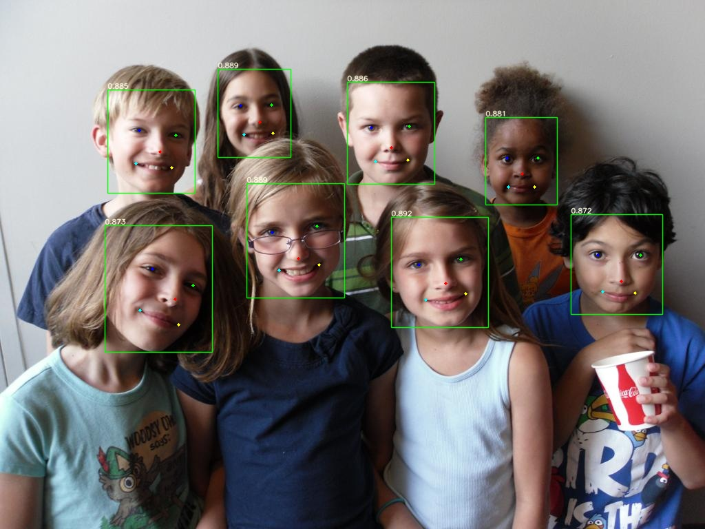
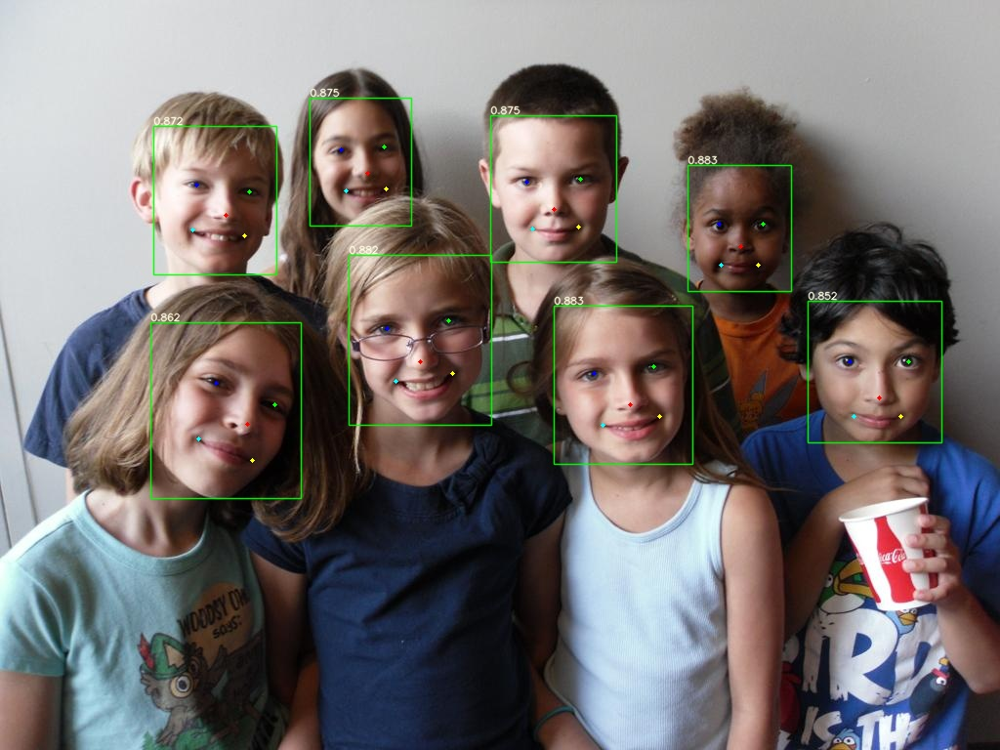

# 整体流程
## 1.Pytorch->ONNX

`/models/export.py`配置weights路径，导出**onnx文件**
## 2.TensorRT推理
`/torch2tensorrt/main.py`配置**onnx文件路径**

图像预处理 -> TensorRT推理 -> 可视化结果

# 耗时对比

| |Pytorch |TensorRT_FP16 |
|:---:|:----:|:----:|
|yolov5n-0.5|11.9ms|2.9ms|
|yolov5n-face|20.7ms|2.5ms|
|yolov5s-face|25.2ms|3.0ms|
|yolov5m-face|61.2ms|3.0ms|
|yolov5l-face|109.6ms|3.6ms|
> 注：(1)仅模型推理  (2)分辨率640x640

# 可视化

<table>
    <tr>
            <th>yolov5n-0.5</th>
            <th>yolov5n-face</th>
    </tr>
    <tr>
        <td></td>
        <td></td>
    </tr>
</table>

<table>
    <tr>
            <th>yolov5s-face</th>
            <th>yolov5m-face</th>
            <th>yolov5l-face</th>
    </tr>
    <tr>
        <td></td>
        <td></td>
        <td></td>
    </tr>
</table>

# TODO

- [ ] TensorRT动态分辨率

- [ ] Pytorch->ONNX->NCNN 

- [ ] Pytorch->ONNX->MNN

