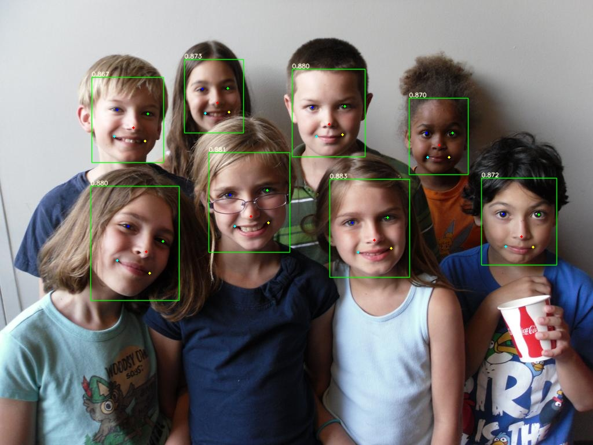

English | [简体中文](readme_CN.md)


# Overall process

## 1.Pytorch->TensorRT

 ```shell
 python export.py --weights "torch's path" --onnx2trt  --fp16_trt 
 ```


## 2.TensorRT inference
```shell
python torch2trt/main.py --trt_path "trt's path"
```
Image preprocessing -> TensorRT inference -> visualization 


# Time-consuming comparison

| Backbone |Pytorch(ms) |TensorRT_FP16(ms) |
|:---:|:----:|:----:|
|yolov5n-0.5|     7.7     |        2.1        |
|yolov5n-face|     7.7     |        2.4        |
|yolov5s-face|     5.6     |        2.2        |
|yolov5m-face|     9.9     |        3.3        |
|yolov5l-face|    15.9     |        4.5        |

>   Pytorch=1.10.0+cu102    TensorRT=8.2.0.6   Hardware=rtx2080ti

```shell
python torch2trt/speed.py --torch_path "torch's path" --trt_path "trt's path"
```


# Visualization

<table>
    <tr>
            <th>yolov5n-0.5</th>
            <th>yolov5n-face</th>
    </tr>
    <tr>
        <td></td>
        <td></td>
    </tr>
</table>

<table>
    <tr>
            <th>yolov5s-face</th>
            <th>yolov5m-face</th>
            <th>yolov5l-face</th>
    </tr>
    <tr>
        <td></td>
        <td></td>
        <td></td>
    </tr>
</table>


